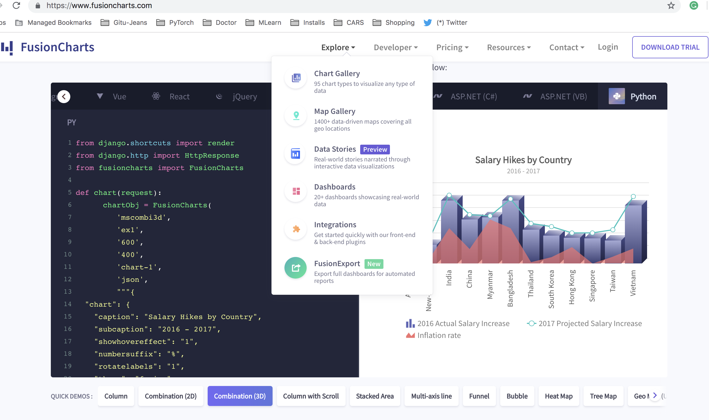

## List various UI & UX samples for inspiration 

### 1. Folder and File menu
- use [codesandbox File menu](https://codesandbox.io/s/kyl0z8yv5?from-embed) as it works well and also good UX.
- code is on [Github](https://github.com/CompuIves/codesandbox-client) -- find which soruce FILE related to "File" menu on scren

- [simple Menu & Caption line on Top](https://javascriptvisualizer.com/?code=function%20bubbleSort%20%28arr%29%20%7B%0A%20%20var%20length%20%3D%20arr.length%3B%0A%20%20var%20swapped%3B%0A%0A%20%20do%20%7B%0A%20%20%20%20swapped%20%3D%20false%3B%0A%0A%20%20%20%20for%20%28var%20i%20%3D%200%3B%20i%20%3C%20length%3B%20i%2B%2B%29%20%7B%0A%20%20%20%20%20%20if%20%28arr%5Bi%5D%20%3E%20arr%5Bi%20%2B%201%5D%29%20%7B%0A%20%20%20%20%20%20%20%20var%20temp%20%3D%20arr%5Bi%5D%3B%0A%20%20%20%20%20%20%20%20arr%5Bi%5D%20%3D%20arr%5Bi%20%2B%201%5D%3B%0A%20%20%20%20%20%20%20%20arr%5Bi%20%2B%201%5D%20%3D%20temp%3B%0A%20%20%20%20%20%20%20%20swapped%20%3D%20true%3B%0A%20%20%20%20%20%20%7D%0A%20%20%20%20%7D%0A%0A%20%20%7D%20while%20%28swapped%29%3B%0A%0A%20%20return%20arr%3B%0A%7D%0A%0AbubbleSort%28%5B5%2C19%2C1%5D%29%3B)
- Sandbox [Client Code ](https://github.com/CompuIves/codesandbox-client/tree/master/packages/app/src/app) as per [this article](https://hackernoon.com/announcing-codesandbox-2-5-be767d15ffd)
- if getting complex get HTML from page "View source" and copy UI and FUncitons.
- **another Option:** use some thing like Jquery FILE/DIr, later see if INd consultant can figure out 'FILE/DIR Menu' of [Stackblitz to extract FILE/DIR code(https://stackblitz.com/edit/react-zbdtps?file=index.js) 

### 2. Folder and File menu 
##### 2.1 Simple File/Folder Menu
- This is Codesandbox Iframe, so it same as above [complex Gitcode base](https://tylermcginnis.com/reactjs-tutorial-a-comprehensive-guide-to-building-apps-with-react/)

##### 2.2 Tabs for Code Editor (Fusion charts)
- top & bottom TABS. Good Top tabs better than plain tabs we saw every where 
- Bottom tabs we can use to as button faces of different versions of code. **such as Ver 1 , Ver 2, Ver 3**
- 'Explore Hover' shows nice compact MENU Options, we can you to show various ML menu options
- FONT size is good, Black theam shows good contrast colour for various Python KEYwords
- screen shot: 

### 6. single page FAQ or explantation page 
- Recurse FAQ page with [Right hand menu](https://www.recurse.com/manual#sec-environment) : View soruce shows so many &nbsp; etc.. take as it .
- Replace hard code with Mobx/React and generate as Static page. Or use some simple templage language like JINJA
- **Full blown Documentation web site :** If we need full blown , we can use this Reactjs.com Documention CODE on github . Here is [web page](https://reactjs.org/docs/conditional-rendering.html) and the [corrosponding github code](https://github.com/reactjs/reactjs.org/blob/cf628304bb431a0680fc58c577f89dd7cac5b269/content/docs/conditional-rendering.md)

###  7. Chat vs. Forum 
- if Forum then Discourse is way to go. Mostly this will do it. If we need CHAT then seems Zulip is one good one
- Recurse is using Zulip (said on above page), also Zulip mentiond it on Zulip web site
